# ASEInternalApp

This repository walks you through implementing a CI/CD pipeline using VSTS or TFS when your web applications are hosted on an Internal Load Balancer (ILB) App Service Environment (ASE). This post will focus on the end-to-end implementation and was inspired by [this article](https://blogs.msdn.microsoft.com/mihansen/2018/01/04/continuous-deployment-with-vststfs-and-app-service-environment-ase/).

The content of this repository is divided in two different Visual Studio solutions: 

## AzureResourceGroup
This solution contains the required ARM templates to deploy a DevOps ILB ASE web app on Azure. For more details, please see the appropriate [details file]().

## WebApplication
This solution contains a basic ASP.NET web application that is used to implement the CI/CD pipeline on VSTS against the ILB ASE web app service. For more details, please see the appropriate [details file]().

# Walkthrough
The purpose of this exercise is to implement a CI/CD pipeline in VSTS with a web app that is behind an Internal Load Balancer (ILB) App Service Environment (ASE). The high-level diagram is as follows:

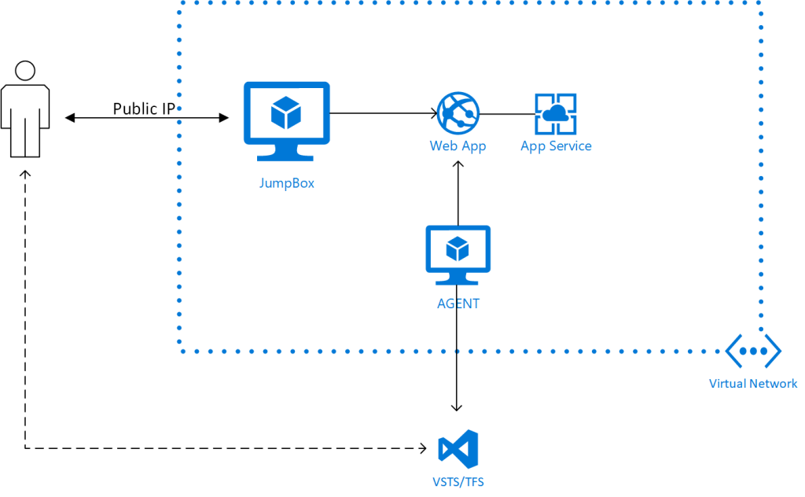

The first step is to have a network environment on Azure. For this demo, I created 2 virtual networks; `Enterprise` and `Corporate` and connected them via Vnet Peering. I also set up a Domain Controller virtual machine `DC1` and a jump box virtual machine `JumpBox` inside the Enterprise virtual network to test the web app access at the end of the exercise.

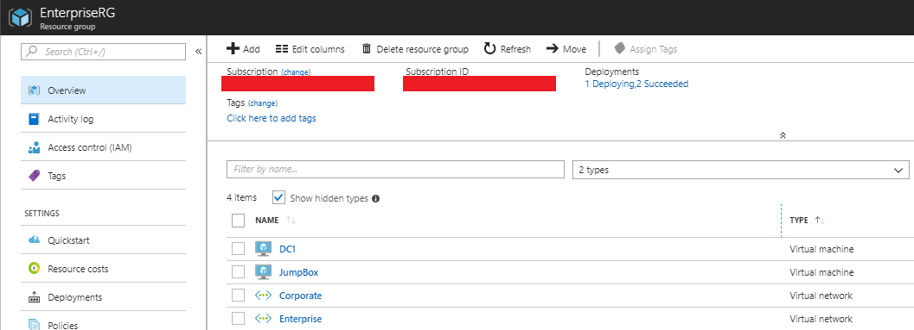

The virtual network Corporate is intended to host the ASE environment and build agent VMs. For that purpose, I have created 2 subnets: `BuildAgentSubnet` and `ILBASESubnet`. NOTE: The subnet passed to the template to deploy the ASE must be empty, otherwise your environment may fail. Below you can see the subnets inside Corporate and their address ranges:

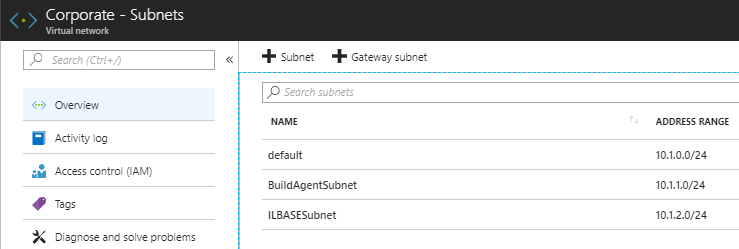

I also made sure to configure the DNS servers in both virtual networks, to provide the proper redirection to the web app domain name later in the lab.

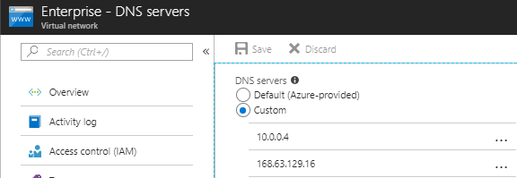


NOTE: if you change the DNS server settings after the creation of any virtual machines, they must be restarted to have these changes applied.

Now I will use the PowerShell Script [PrepareDevopsAseEnviroment.ps1](AzureResourceGroup/DevOpsAse/pre-requisites/PrepareDevopsAseEnvironment.ps1) to generate some of the parameters for my deployment. Below is the execution of the PS script using PowerShell ISE:

```
cd <repository-location>\AzureResourceGroup\DevOpsAse\

& .\pre-requisites\PrepareDevopsAseEnvironment.ps1 `
    -DomainName "contoso.com" `
    -CertificatePassword (ConvertTo-SecureString "******" -AsPlainText -Force) `
    -VnetResourceGroupName "EnterpriseRG" `
    -VnetName "Corporate" `
    -AseSubnetName "ILBASESubnet" `
    -AgentVmSubnetName "BuildAgentSubnet" `
    -VSTSAccountName "******" `
    -OutFile ".\azuredeploy.parameters.json"
```
The `VSTSAccountName` is the first part of the URL you use to log in to the VSTS/TFS portal. In my case the URL is https://marvin-garcia.visualstudio.com/, so my account name is "marvin-garcia".

After running the PS code above as an administrator, it generates the file azuredeploy.parameters.json with most of the required parameters auto populated. You must finish filling up the remaining empty parameters.

NOTE: if you don’t want to create a web app at this moment, you can leave the parameter “siteName” empty and it will skip that step for another time.
NOTE: refer to [this article](https://docs.microsoft.com/en-us/vsts/accounts/use-personal-access-tokens-to-authenticate?view=vsts) to know how to generate personal access tokens in VSTS/TFS.

Once you have filled all the remaining parameters, you can deploy the DevOpsAse template in your Azure subscription. For more details on how to deploy resources using Azure PowerShell, refer to [this article](https://docs.microsoft.com/en-us/azure/azure-resource-manager/resource-group-template-deploy). After waiting around 60-80 minutes, you will see your ASE and build agent VM deployed in your Azure subscription. In this demo I used separate resource groups for the ASE and agent VM for isolation purposes. Below you can see the resources contained in each resource group:

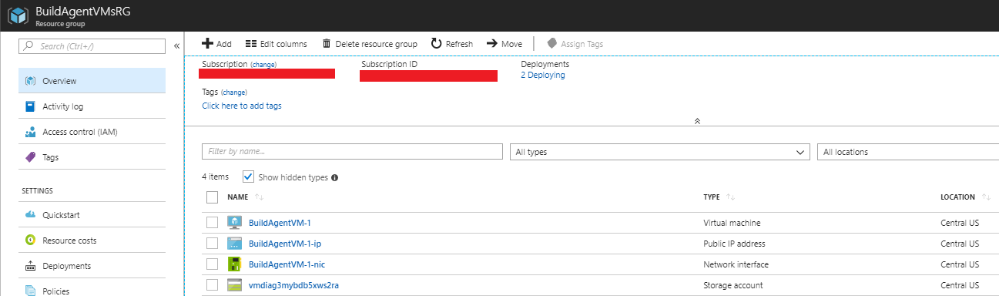
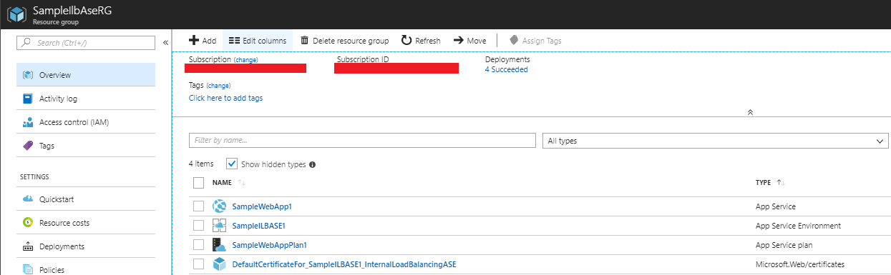

If you explore the App Service Environment resource (SampleIlbAse1 in the image above), you will be able to confirm that the ILB certificate has been successfully configured and that it contains one app service plan and web application.

At this point, the work on the Azure side is completed. The next steps will focus on the build/release configuration in your VSTS/TFS account. For this to work in your case, you must have an ASP.NET or .NET Core web application in a repository of your choice (GitHub, VSTS or TFS account). This tutorial will use the [WebApplication ASP.NET solution](ASEInternalApp/WebApplication) from this repository.


You can check if the build agent VM was successfully added to the agent pool you selected. For more information about how to manage agent queues/pools in VSTS/TFS, please visit [this article](https://docs.microsoft.com/en-us/vsts/build-release/concepts/agents/pools-queues?view=vsts).

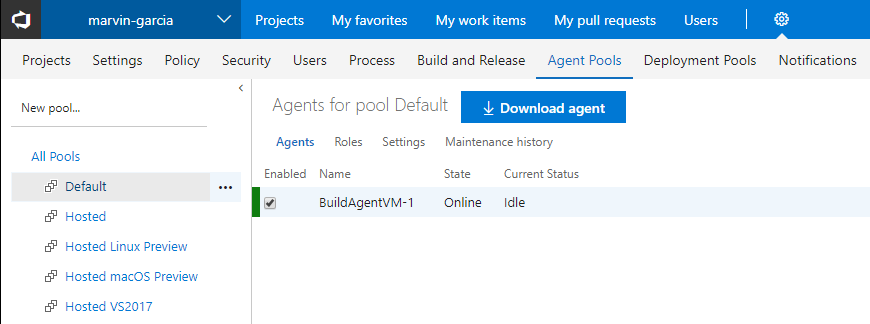

This tutorial won’t go into much details about how to create build and release definitions in VSTS/TFS, for more insights on this topic, please refer to [this article](https://docs.microsoft.com/en-us/vsts/build-release/actions/ci-cd-part-1?view=vsts). For this tutorial I decided to create a new Build based on the ASP.NET build template for web applications, but you can choose any template that matches your project needs. After configuring my build process for the web application, it looks like this:

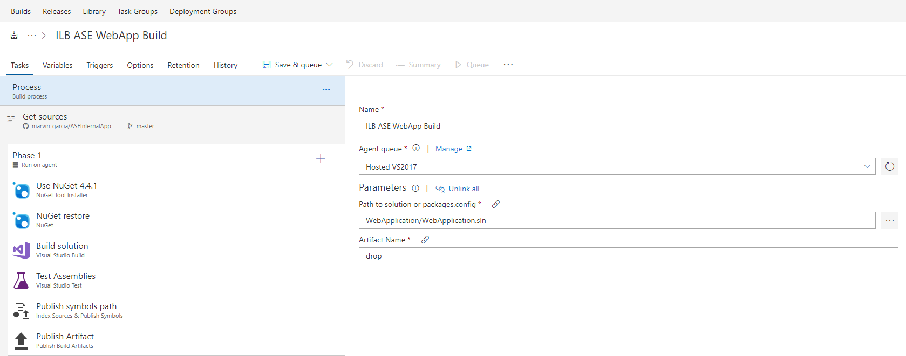

In the Agent queue dropdown list, you can see both your hosted and private queues, you can choose to run this build on the build agent VM that was created along with the deployment. Save and queue the build to make sure that it goes through without any issues.

Now you need to create a Release definition to publish your code to the web app inside the ASE. In this case I used the Azure App Service Deployment release template, you can choose any other that matches your needs, or start with an empty process and fill it on your own.

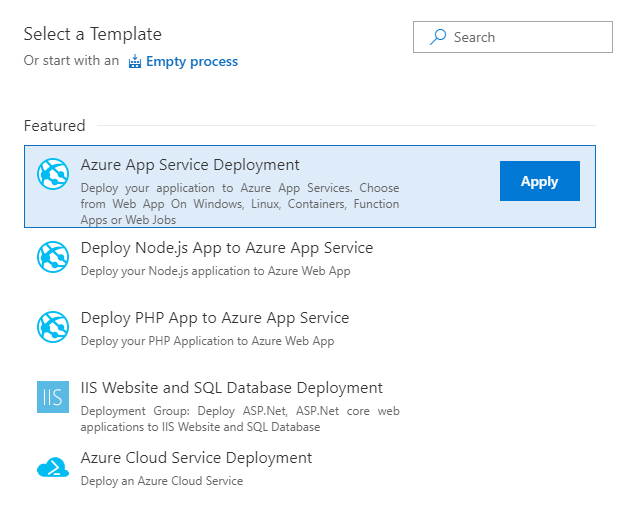

You must ensure that your release definition has the build definition that was created in the previous step as one of its artifacts, you can choose whether to activate the Continuous Deployment trigger, so every time a build succeeds it can be automatically released to your Azure web app.

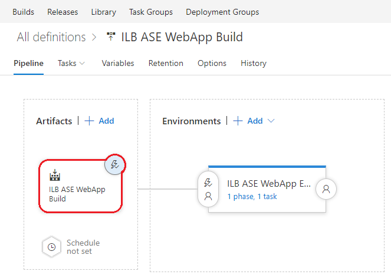

After setting up the deployment details with your Azure account, you must select the agent queue that contains your agent VM(s) on Azure, otherwise the agent won’t be able to access the ASE environment.

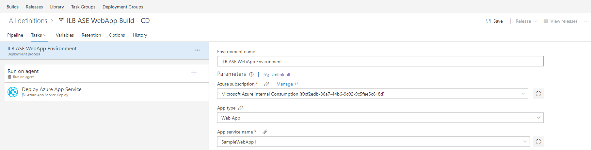
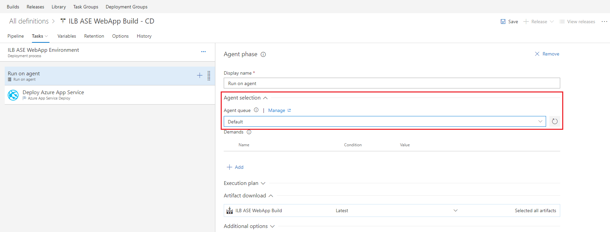

Lastly, if you used a self-signed certificate for the ASE configuration, you need to set the option`-allowUntrusted` in the Additional Deployment Options section. Ensure the rest of the phase configuration matches your deployment needs, and then save the progress.

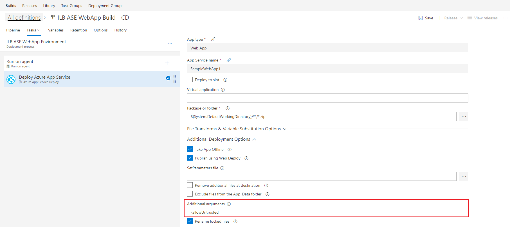

Before you can test your CI/CD pipeline you must make sure that your web app is accessible from inside the network. In order to do this, I created two new A records in my Domain Controller’s DNS zone to point to the IP address of the ASE environment. First, you must copy both the IP address of the ILB of the ASE and the URL of the web app.

To get the ILB IP address, go to the `IP addresses` section of your App Service Environment resource:
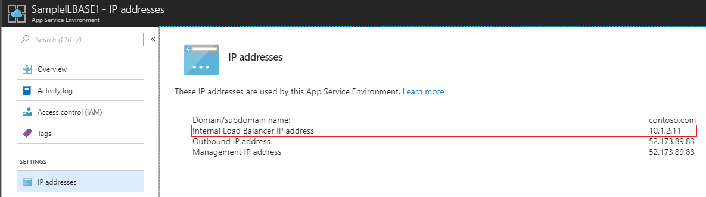

You will find the App servier URL in the `overview` section of your App Service resource:
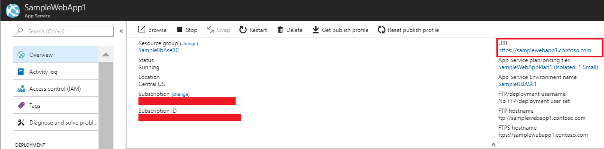

Your DNS server must include both `.<your-domain>` and `*.scm.<your-domain>`, The reason for the second entry is that SSL connections to the SCM/Kudu site associated with your app will be made using that address. For more details please refer to [this article](https://docs.microsoft.com/en-us/azure/app-service/environment/app-service-environment-with-internal-load-balancer). After creating the A host records, my DNS zone look like this:

A host record for samplewebapp1.contoso.com
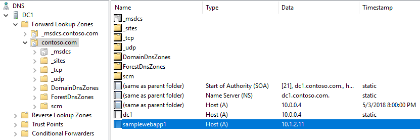

A host record for samplewebapp1.scm.contoso.com
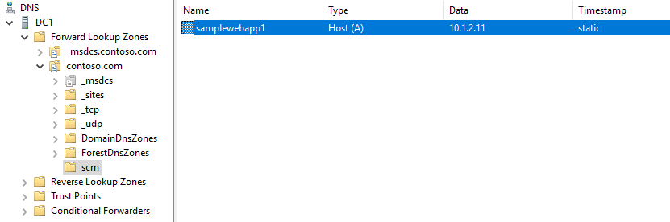

The next step is to access the website from inside the network, in my case I used the `JumpBox` virtual machine allocated in the Enterprise virtual network. After opening the browser, navigating to the App service URL and skipping the certificate mismatch warning, you should see the welcome page for the web app solution.

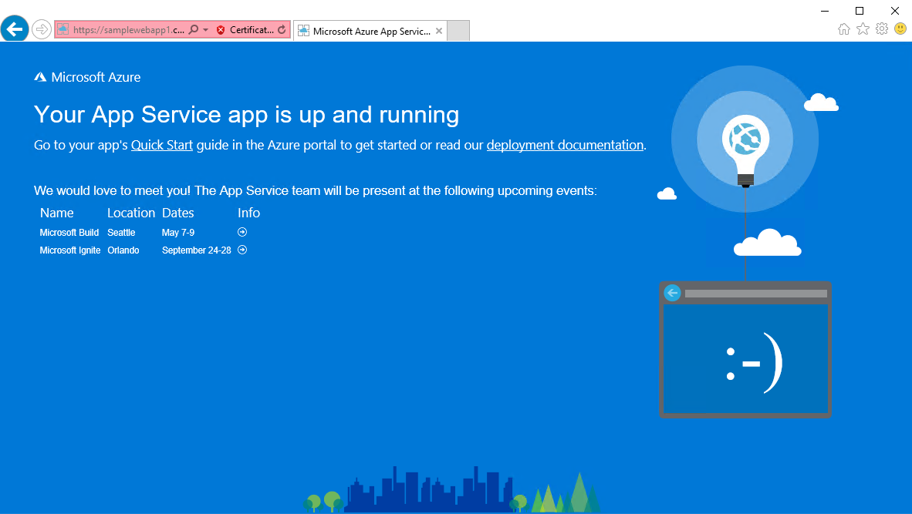

Now let’s make some changes to the code and see if they get automatically pushed to the app service. I made a text change in the file [Index.cshtml](WebApplication/WebApplication/Views/Home/Index.cshtml) to be able to notice it immediately when I navigate to it. You can make any code changes to your web application; the idea is to see them take effect without any manual intervention. If you enabled continuous deployment in the build definition, you should see a new build in progress in your VSTS/TFS account after committing and pushing the changes to the repository, otherwise you will have to queue it manually through the VSTS/TFS portal. You can check the build history and note that some of them were triggered manually or requested by the Visual Studio service.

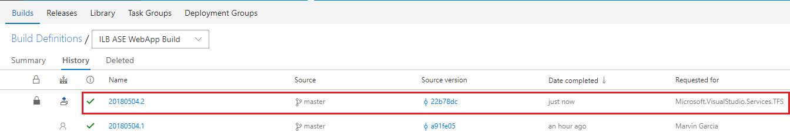

If you enabled continuous deployment in the release definition, you will see a new release in progress after the build has passed, otherwise you will have to trigger it manually. Once the released has succeeded, go back to the browser and refresh the page. Your code changes should be available now.

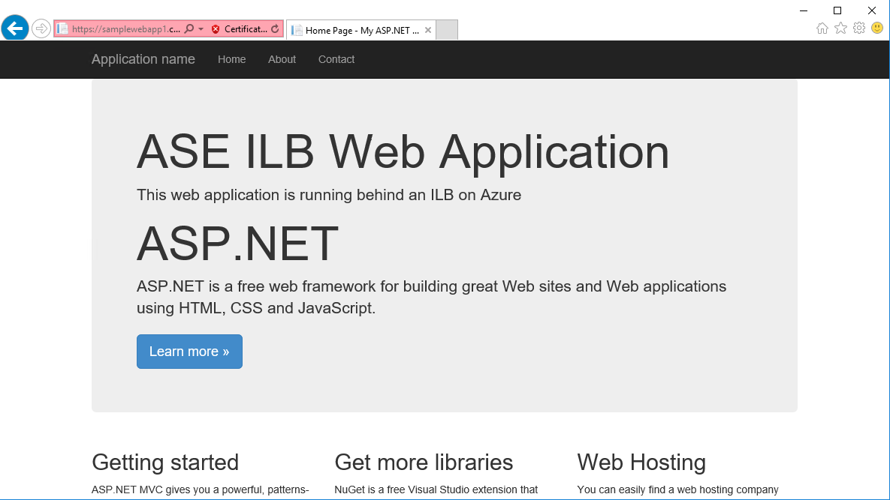

And that's it! At this point you must have been able to successfully implement a CI/CD process against a web application hosted in your Azure virtual network through an ILB App Service Environment.
